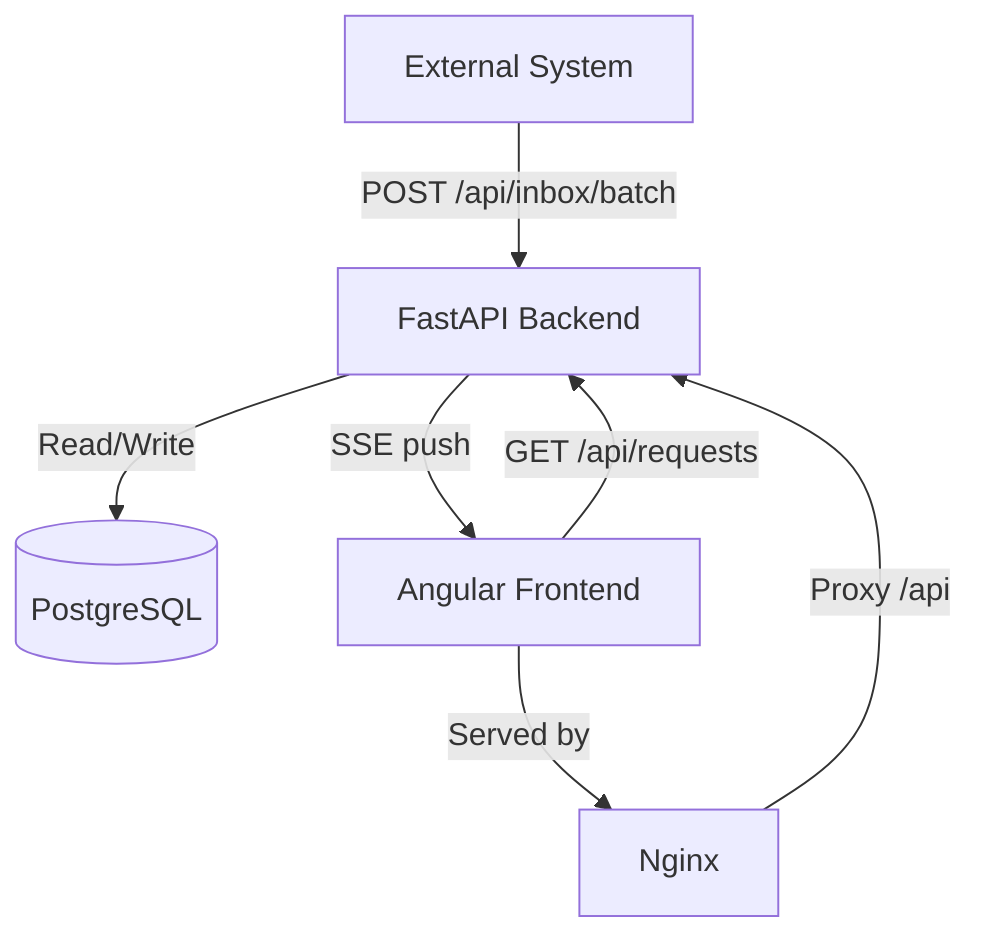

# Clinic Inbox — Architecture Document

## System Overview



## Data Flow

```
External System
      │
      │ POST /api/inbox/batch (JSON array of items)
      ▼
┌──────────────────────────────────┐
│        FastAPI Backend           │
│                                  │
│  1. Validate with Pydantic       │
│  2. For each item (by external_id):
│     • New → find/create request, │
│             attach item          │
│     • Exists → update content,   │
│       handle dept reassignment,  │
│       handle closing             │
│  3. Check affected requests →    │
│     close if all items closed    │
│  4. Commit transaction           │
│  5. Broadcast SSE to subscribers │
└──────────┬───────────────────────┘
           │
           ▼
┌──────────────────┐     ┌──────────────────────────┐
│   PostgreSQL     │     │   Angular Dashboard       │
│                  │     │                           │
│ patient_requests │     │ • Dept tabs (Material)    │
│ inbox_items      │     │ • Request list with SSE   │
│                  │     │   auto-refresh             │
└──────────────────┘     │ • Request detail view     │
                         └──────────────────────────┘
```

## Data Model

### Two-table design

| Table | Purpose |
|-------|---------|
| `patient_requests` | One record per patient per department. Groups inbox items. Closed when all items are closed. |
| `inbox_items` | Individual messages from the external system. Linked to a request via `request_id`. |

**Why no `patients` or `departments` tables?** Patient ID is an opaque external identifier and departments are a fixed enum. Adding separate tables would be premature normalization with no benefit for this use case. If departments ever need metadata (head doctor, capacity), they can be promoted to a table later.

### Key constraints

- **Partial unique index** on `patient_requests(patient_id, department) WHERE status = 'Open'` — ensures at most one open request per patient per department while allowing multiple closed (historical) requests.
- **`external_id` unique constraint** on `inbox_items` — enables idempotent batch processing.
- **`medications` stored as JSONB** — avoids a join table since medications are an attribute, not a first-class entity.

## Architecture Decisions & Trade-offs

| Decision | Chosen | Alternative | Rationale |
|----------|--------|-------------|-----------|
| Single transaction per batch | Yes | Chunked sub-transactions | Consistency: partial batch processing would leave inconsistent state. Acceptable for expected batch sizes (100-1000 items). |
| Sequential item processing | Yes | Bulk upsert | Simpler conflict resolution when multiple items in same batch affect same request. Adequate for clinic-scale volumes. |
| SSE for live updates | Yes | WebSocket / Polling | One-way server→client push is all we need. SSE is simpler (plain HTTP), auto-reconnects, no sticky sessions required. |
| SSE notify + REST re-fetch | Yes | Push full data via SSE | Keeps the SSE protocol trivial. REST endpoint handles pagination/filtering consistently. Extra round-trip is negligible. |
| JSONB for medications | Yes | Separate table | Fewer joins; medications are item attributes, not entities needing referential integrity. |
| No auth for prototype | Yes | JWT/OAuth | Out of scope for prototype. Production would add authentication middleware. |
| Soft delete via content clearing | Yes | Separate audit table | Matches requirement: "keep the item record for audit." The record itself is the audit trail. |
| Repository pattern | Yes | Direct queries in services | Separation of concerns. Repositories handle SQL; services handle business logic. Easier to test and swap DB implementations. |

## Assumptions & Constraints

### Scale
- **Clinics**: 10–50 clinic locations in the network
- **Patients**: ~1,000 active patients per clinic (~50K total)
- **Items**: ~10 active items per patient at peak → ~500K total items
- **Batches**: 100–1,000 items per batch, arriving every few minutes
- **Concurrent users**: ~50–200 doctors viewing dashboards simultaneously

### Business Assumptions

1. **`external_id` is the sole item identifier** — each inbox item is uniquely identified by the `external_id` provided by the external system. This is the key used for idempotent upsert during batch ingestion (unique constraint on `inbox_items.external_id`).
2. **One open request per patient per department** — enforced by a partial unique index (`WHERE status = 'Open'`). Multiple closed (historical) requests can coexist for the same patient+department pair.
3. **Closure is terminal** — a closed item is never reopened; a closed request is never reopened. New items for the same patient+department create a new request.
4. **Content is cleared on item closure** — when an item transitions to `Closed`, its `message_text` and `medications` are set to `NULL`. The item record itself serves as the audit trail (soft delete).
5. **Department reassignment preserves item identity** — the same `external_id` can move to a different department. The item is detached from the old request and attached to an open request in the new department (created if needed). If the old request has no remaining open items, it auto-closes.
6. **Request auto-closes when all its items close** — after processing each batch, every affected request is checked; if zero open items remain, the request status becomes `Closed`.
7. **Departments are a fixed enum** — `Dermatology`, `Radiology`, `Primary`. No runtime configuration or database table for departments.
8. **`patient_id` is an opaque external identifier** — no `patients` table; the ID is stored as a plain string (`VARCHAR(100)`). No format or pattern validation is enforced.

### Technical Assumptions

1. **No batch size limit** — there is no enforced cap on the number of items in a single batch request. The system is designed for 100–1,000 items per batch but will accept any size. Large batches run in a single transaction.
2. **All-or-nothing batch processing** — the entire batch is processed within a single database transaction. If any item fails, the whole batch rolls back. No partial success or per-item error reporting.
3. **`patient_id` is immutable for an existing `external_id`** — once an inbox item is ingested, its `patient_id` cannot change. If the external system sends the same `external_id` with a different `patient_id`, the item is declined with an error. This prevents silent patient-identity corruption and ensures an item always belongs to the patient it was originally associated with.
4. **No authentication or authorization** — the prototype has no auth. Any client can ingest batches, query requests, or subscribe to SSE streams.
5. **No rate limiting** — the batch endpoint accepts unlimited requests. No throttling or API keys.
6. **No field-length validation at the API layer** — while the database columns have length limits (`patient_id` 100 chars, `external_id` 255 chars), the Pydantic schemas do not enforce these limits. Oversized values will fail at the database level with an unhandled error.
7. **Medications are unvalidated** — accepted as a JSON list of strings with no constraints on list length, string length, or content. No drug-name validation or deduplication.
8. **SSE subscriptions are unauthenticated and unfiltered by role** — any client can subscribe to any department's events or to all departments at once. Filtering is optional via a `department` query parameter.
9. **Optimistic concurrency via database constraints** — no pessimistic locks. The partial unique index on open requests handles race conditions: on `IntegrityError`, the service retries by fetching the existing open request.
10. **Sequential batch processing assumed** — no concurrent batch ingestion protection beyond the unique constraints. The prototype assumes batches arrive and are processed one at a time.

### Known UI–Data Inconsistencies

1. **Expanded request detail does not live-update** — when a request row is expanded in the dashboard, SSE-triggered refreshes replace the `requests` signal with new object references, but the `expandedRequest` signal still holds the old object. The expanded detail view shows stale data until the user collapses and re-expands the row.
2. **Closed items visible inside open requests, but invisible once the request closes** — the dashboard only fetches requests with `status = 'Open'` (hardcoded in the frontend). Within an open request, a mix of open and closed items is displayed. However, once the last open item closes, the request auto-closes and disappears entirely from the dashboard — the user can no longer see any of the closed items that belonged to it. There is currently no UI to browse closed/historical requests. As a side effect, the `status` column in the request table will always show `Open`, since closed requests are never returned.

### Data Ordering
- Batches arrive in roughly chronological order.
- Within a batch, item order doesn't matter (each is processed independently).
- Last-write-wins for content updates (no conflict resolution needed at prototype scale).
- Requests are returned sorted by `updated_at DESC` (most recently active first).
- Items within a request have no guaranteed ordering (database insertion order).
- Pagination is capped at 100 items per page (`page_size` max = 100).

## Scaling Guidelines & Future Improvements

### Short-term (1K → 10K concurrent users)

1. **Horizontal backend scaling**: FastAPI is stateless — add instances behind a load balancer. SSE connections require a shared pub/sub layer:
   - Add **Redis Pub/Sub** so any backend instance can broadcast to all SSE subscribers
   - Use `redis.subscribe(f"dept:{department}")` pattern

2. **Database read replicas**: Route GET endpoints to read replicas. Write operations (batch ingestion) go to the primary.

3. **Connection pooling**: Use PgBouncer in front of PostgreSQL to manage connection limits.

4. **Batch size limit**: Cap single batch ingestion requests at 1,000 items (reject with `HTTP 413` above the limit). This bounds transaction duration and memory pressure per request.

5. **Rate limiting**: Apply per-client rate limits on the batch ingestion endpoint (e.g. 10 requests/minute per API key) using a token-bucket algorithm backed by Redis. Return `HTTP 429` with a `Retry-After` header when exceeded.

### Medium-term (10K → 100K items/batch)

6. **Chunked batch processing**: Split large batches into sub-batches of ~500 items, each in its own transaction. Add a batch status tracking table for progress/retry.

7. **Background processing**: Move batch ingestion to a task queue (Celery/RQ with Redis). The API endpoint returns a batch ID immediately; clients poll for completion.

8. **Database partitioning**: Partition `inbox_items` by `created_at` (range partitioning). Archive old closed items to cold storage.

### Long-term (production hardening)

9. **Authentication & authorization**: JWT tokens with role-based access. Doctors see only their department. Admins see all.

10. **Audit log table**: Separate `item_audit_log` table capturing every change (old value → new value) for compliance.

11. **Monitoring & observability**: Structured logging, Prometheus metrics, distributed tracing (OpenTelemetry).

12. **Event sourcing**: For full auditability, store every batch as an immutable event. Rebuild current state by replaying events. Higher complexity but complete history.

13. **API versioning**: `/api/v1/` prefix for backward compatibility as the API evolves.
